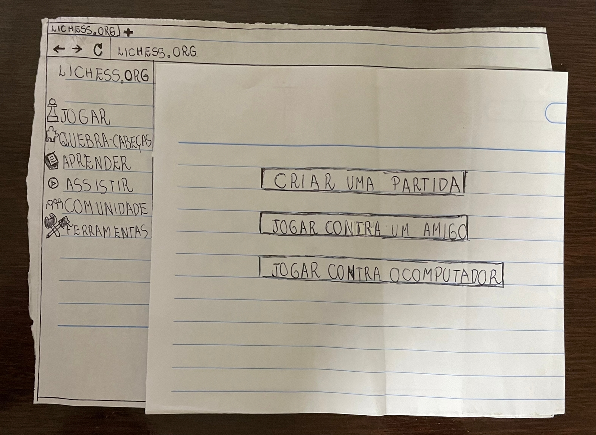

# Relato de resultados do protótipo de papel

## Introdução

Protótipos tem como objetivo permitir que usuários e stakeholders consigam interagir com um produto pensado. Isso é extremamente prática para coleta de pontos positivos e negativos acerca de uma funcionalidade ou o produto como um todo.

A utilização de protótipo de papel permite o foco na funcionalidade, deixando abstrato para o usuário questões como design, dessa forma a chance do usuário se distrair é menor.

Principais benefícios da utilização de protótipos são: reflexão do design, esclarecimento de requisitos e realização de testes iniciais.

## Objetivos

Essa avaliação tem como objetivo entender no aplicativo e em fluxos alternativos, o que está sendo bem implementado e o que seria melhor alterar, tendo uma lista de feedback de usuários reais.

## Metodologias

Para a maior fonte de informações possíveis o projeto de IHC Lichess decidiu utilizar entrevistas para coletar os pontos negativos e positivos do design. Além disso a entrevista permite realizar uma série de perguntas para direcionar a simulação.

Antes da entrevista duas ações devem ser executadas: elaboração do protótipo de papel e teste piloto.

Teste piloto é uma execução preliminar da entrevista, comumente realizada o próprio grupo de desenvolvedores ou pequena amostra de participantes a fim de avaliar os aspectos da avaliação e corrigir eventuais falhas antes da implementação definitiva, o que caso não seja feito, pode invalidar dados coletados.

## Avaliadores e participantes

A entrevista foi conduzida pelos avaliadores Lucas  Macedo e Lucas Gabriel. O entrevistador Lucas Macedo ficou responsável por gravar a execução do teste e observar o comportamento do usuário, de forma que o entrevistador Lucas Gabriel fez as perguntas e interação com o usuário. Quanto ao participante, o planejado era entrevistar 3 pessoas, porém, devido à má comunicação da equipe e a falta de organização, acabou sendo registrado apenas uma pessoa. Para preservar o participante, o nome e idade do entrevistado não será utilizado e serrá utilizado um nome fictício. O primeiro entrevistado, no qual será chamado de Pedro, tem 24 anos e é responsável por jogar uma partida, criando o modo e entrando para jogar contra o computador.

[comment]: <> (TO DO: Acresentar mais informações no texto)

## Protótipo de papel

### Jogar uma partida

A seguir, temos as imagens do protótipo de jogar uma partida

**Imagem 1: Termo de consentimento (Fonte: Autores, 2023).**

**Imagem 2: Termo de consentimento (Fonte: Autores, 2023).**

**Imagem 3: Termo de consentimento (Fonte: Autores, 2023).**

**Imagem 4: Termo de consentimento (Fonte: Autores, 2023).**

**Imagem 5: Termo de consentimento (Fonte: Autores, 2023).**

## Entrevista

<iframe width="560" height="315" src="https://www.youtube.com/embed/Do0G24sgXJQ" title="YouTube video player" frameborder="0" allow="accelerometer; autoplay; clipboard-write; encrypted-media; gyroscope; picture-in-picture; web-share" allowfullscreen></iframe>

**Vídeo 1: Termo de consentimento (Fonte: Autores, 2022).**

## Conclusão

Sentimos a necessidade de gravar com outras pessoas, pois apenas uma não deu para avaliar a interação do usuário de forma precisa. Com isso, o grupo precisa relatar melhor os resultados.

[comment]: <> (TO DO: Quando realizar mais avaliações, mudar a conclusão para serem englobadas)

## Bibliografia

[1] BARBOSA, Simone; DINIZ, Bruno. Interação Humano-Computador. Editora Elsevier, Rio de Janeiro, 2010.

[2] Seidman, Irving (2019). Interviewing as Qualitative Research: A Guide for Researchers in Education and the Social Sciences. Teachers College Press, New York, NY, 5th edition edition.

## Histórico de Versão

| Versão | Data       | Descrição            | Autor(es)        | Revisor(es)   |
| ------ | ---------- | -------------------- | ---------------- | ------------- |
| `1.0`  | 11/01/2022 | Criação do documento | Lucas Macedo e Lucas Gabriel | Davi |
