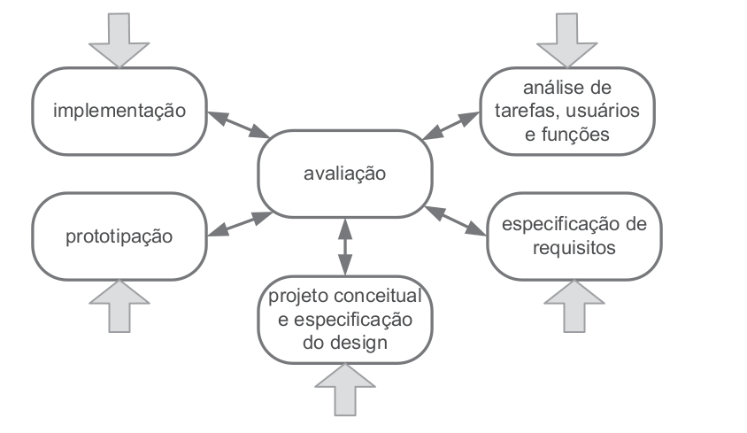

# Processo de Design

## Introdução

O projeto de design de Interação Humano Computador perpassa por três atividades básicas: **análise**, **síntese** e **avaliação**. A atividade de análise tem como principal objetivo estudar e interpretar uma situação, na qual serão planejadas e executadas intervenções, durante a etapa de síntese, cujo efeito será verificado por meio da avaliação. Uma **intervenção** consiste em uma solução para algum problema a ser resolvido, e pode ser avaliada durante todas as suas etapas, desde a concepção até após a aplicação.

A organização das atividades básicas citadas no parágrafo anterior pode ser feita de maneiras diferentes, e os processos de design em IHC propõem a execução dessas atividades de forma iterativa, para que seja possível refinar sucessivamente as intervenções propostas e a análise da situação atual.

A elaboração de uma Interação Humano Computador tem como principal objetivo atender e servir os usuários e os demais envolvidos (_stakeholders_), por este motivo, a maior parte dos processos de design são **centrados no usuário**, e seguem os princípios de **foco no usuário**, **métricas observáveis** e **design interativo**.

Para que o primeiro princípio, foco no usuário, seja atendido é necessário que o designer estude o perfil dos usuários do sistema. O segundo princípio parte de premissa de que o processo deve permitir a realização de experimentos que forneçam dados como, por exemplo, a performance e as reações dos usuários ao utilizar o sistema. Por fim, o último princípio permite que as etapas do processo de design possam se repetir à medida que as necessidades apareçam.

As atividades do processo de design podem ser organizadas de acordo com alguns ciclos de vida de projeto, alguns desses modelos estão detalhados a seguir.

## Ciclo de vida simples

No ciclo de vida simples (Figura 1), a atividade de sínteses é dividida em design (ou redesign) e na construção de uma versão interativa. A iteração entre as atividades pode ocorrer quantas vezes forem necessárias.

 Figura 1: Ciclo de vida simples (Fonte: [1]).

Esse ciclo de vida é mais indicado para designers experientes, em detrimento do baixo nível de detalhamento das atividades.

## Ciclo de vida em estrela

No ciclo de vida em estrela (Figura 2), o designer pode começar o processo por qualquer uma das pontas, desde que, após concluir cada atividade, este realize uma avaliação dos resultados obtidos. Neste modelo, a atividade de síntese é dividida nas atividades de projeto conceitual e especificação do design, prototipação e implementação.

 Figura 2: Ciclo de vida em estrela (Fonte: [1]).

Embora possua um nível maior de detalhamento, em relação ao [ciclo de vida simples](#ciclo-de-vida-simples), o ciclo de vida em estrela também é mais adequado para designers experientes, pois ainda apresenta um baixo nível de detalhamento.

## Ciclo de Vida de Nielsen

Nielsen definiu **engenharia de usabilidade** como as seguintes atividades como essenciais durante todo o ciclo de via de um produto:

> 1. Conhecer o usuário;
> 2. Realizar uma análise competitiva (examinar produtos com funcionalidades semelhantes);
> 3. Definir as metas de usabilidade;
> 4. Fazer designs paralelos (criar alternativas de design);
> 5. Adotar o design participativo (acesso da equipe à usuários representativos do público alvo);
> 6. Fazer o design coordenado da interface como um todo (design de todos os elementos da interface, como documentação, sistema de ajuda e etc);
> 7. Aplicar diretrizes e análise heurística;
> 8. Fazer protótipos;
> 9. Realizar testes empíricos;
> 10. Praticar design iterativo (correção de problemas durante as iterações de design e avaliação);

As atividades propostas por Nielsen estão presentes nos demais ciclos de vida, mas da forma como foram propostas não orientam uma ordem interativa para as atividades.

## Ciclo de vida da Mayhew

Nesse ciclo de vida as atividades são divididas em três fases: análise de requisitos, design/avaliação/desenvolvimento e instalação, representados em detalhes na Figura 3. A primeira fase consiste na definição das metas de usabilidade, com base em dados coletados por meio de atividades como a análise do perfil do usuário e das tarefas. Durante a segunda fase o designer elabora uma solução de IHC atendendo as metas de usabilidade definidas na primeira fase. Por fim, na etapa de instalação, o projetista coleta opiniões dos usuários após o uso do sistema e utiliza tais opiniões na elaboração de melhorias.

 Figura 3: Ciclo de vida da Mayhew (Fonte: [1]).

Dentre os modelos estudados [1], o ciclo de vida da Mayhew é o mais detalhado, com a maior quantidade de atividades interativas de **análise**, **sínteses** e **avaliação**.

## Ciclo de vida do projeto

A Engenharia de Usabilidade de Mayhew reúne e organiza diferentes atividades na área de Interação Humano Computador, orientando o designer por uma direção interativa [1]. Por meio desse ciclo de vida, é possível, por meio de atividades bem detalhadas, conhecer o perfil do usuário do site, e só então partir para uma etapa de design, sempre apoiada na avaliação, iterando por prototipações em diversos níveis. Dessa forma, durante todas as etapas do ciclo a interação entre as fases do projeto mostra-se presente.

A definição deste ciclo de vida para o projeto levou em consideração os fatores supracitados, o nível de detalhamento das atividades de cada fase e o processo de aprendizagem dos estudantes do grupo. Dessa forma, o [cronograma](cronograma.md) foi elaborado de acordo com as atividades de **análise de requisitos** e **design, avaliação e desenvolvimento**. Dada a natureza do projeto, as atividades de **instalação** foram executadas juntamente com a análise de requisitos, pois o produto já está finalizado.

## Bibliografia

[1] BARBOSA, Simone; DINIZ, Bruno. Interação Humano-Computador. Editora Elsevier, Rio de Janeiro, 2010.

## Histórico de Versão

| Versão   | Data       | Descrição            |  Autor(es)       | Revisor(es)          |
| :------: | :--------: |:-------------------: | :-----------: | :-----:          |
| `1.0`    | 18/11/2022 | Criação do documento. | Nicolas Souza | Davi Silva |
| `1.1`    | 07/12/2022 | Melhorando justificativa da escolha do ciclo de vida. | Nicolas Souza | Lucas Macedo |
| `1.2`    | 29/01/2023 | Ajustes após a verificação do artefato. | Nicolas Souza |
