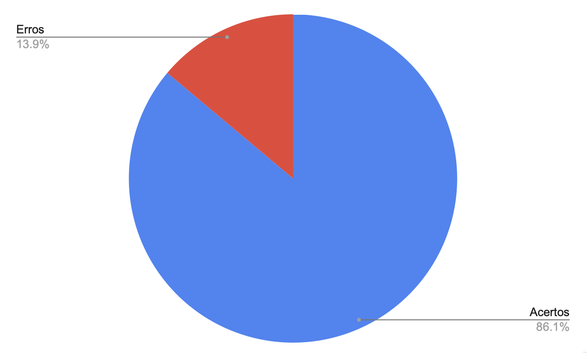

# Relato de Resultados da Verificação do Ponto de Controle 3

## Introdução

O presente artefato contém os resultados da verificação dos artefatos produzidos durante o ponto de controle 3:

- [Cronograma](../../planejamento/cronograma.md)
- [Cronograma Realizado](../../planejamento/cronograma_realizado.md)
- [Princípios Gerais do Projeto](../../analise_requisitos/principios_gerais.md)
- [Meta de Usabilidade](../../analise_requisitos/metas_usabilidade.md)
- [Guia de Estilo](../../analise_requisitos/guia_de_estilo.md)

## Metodologia

A verificação foi feita com base nos checklists definidos no [planejamento](./planejamento.md).

## Resultado

### Verificação Checklist Padronização

A verificação de padronização visa determinar se o artefato está de acordo com o padrão do projeto.

| ID  | Questão                                                                  |  Resposta  | Comentário                                                                                                     |
| :-: | :----------------------------------------------------------------------- | :--------: | -------------------------------------------------------------------------------------------------------------- |
|  1  | As legendas estão no padrão do projeto?                                  |    Sim     |                                                                                                                |
|  2  | Possui links para os outros artefatos?                                   |    Sim     | Entretanto, a utilização de referências precisa ser padronizada.                                               |
|  3  | Existe uma introdução no artefato?                                       |    Sim     |                                                                                                                |
|  4  | Existe tabela de versionamento padronizado e completo?                   |    Sim     |                                                                                                                |
|  5  | Há referências bibliográficas no artefato?                               |    Sim     | Duas referências precisam ser padronizadas, elas estão presentes no artefat o **Princípios Gerais do Projeto** |
|  6  | As tabelas e imagens possuem legenda, fonte e são introduzidas no texto? | Incompleto | Em guia de estilo o quadro elementos de interface carece de legenda e referência textual                       |
|  7  | Vídeo de apresentação na categoria "não listado" do youtube?             |    Sim     |                                                                                                                |
|  8  | Cronograma executado da etapa 3 com datas de início e fim?               |    Sim     |                                                                                                                |
|  9  | Atas das reuniões?                                                       |    Sim     |                                                                                                                |
| 10  | Gravação das reuniões do grupo?                                          |    Sim     |                                                                                                                |

Tabela 1: Verificações de padronização (Fonte: Mauricio Machado, 2023).

## Verificação Checklist Princípios Gerais do Projeto

Abaixo temos uma tabela que apresenta o checklist do artefato [Princípios Gerais do Projeto](../../analise_requisitos/principios_gerais.md).

| ID  |                                           Questão                                           | Resposta (Sim, Não, Incompleto) | Justificativa (opcional) |
| :-: | :-----------------------------------------------------------------------------------------: | :-----------------------------: | ------------------------ |
|  1  |                    Os Princípios Gerais que serão utilizados no projeto?                    |               Sim               |                          |
|  2  | Tópico _Correspondência com as expectativas dos usuários_ está presente no site do Lichess? |               Não               |                          |
|  3  |     Tópico _Simplicidade nas estruturas das tarefas_ está presente no site do Lichess?      |               Sim               |                          |
|  4  | Tópico _Equilíbrio entre controle e liberdade do usuário_ está presente no site do Lichess? |               Não               |                          |
|  5  |           Tópico _Consistência e padronização_ está presente no site do Lichess?            |               Sim               |                          |
|  6  |        Tópico _Promoção da eficiência do usuário_ está presente no site do Lichess?         |               Sim               |                          |
|  7  |     Tópico _Antecipação das necessidades do usuário_ está presente no site do Lichess?      |               Não               |                          |
|  8  |          Tópico _Visibilidade e reconhecimento_ está presente no site do Lichess?           |               Sim               |                          |
|  9  |     Tópico _Conteúdo relevante e expressão adequada_ está presente no site do Lichess?      |               Sim               |                          |
| 10  |                Tópico _Projeto para erros_ está presente no site do Lichess?                |               Não               |                          |

 Tabela 2: Checklist verificado do artefato Princípio Gerais do Projeto (Fonte: Mauricio Machado, 2023).

## Verificação Checklist Metas de Usabilidade

Abaixo temos uma tabela que apresenta o checklist do artefato [Meta de Usabilidade](../../analise_requisitos/metas_usabilidade.md).

| ID  |                               Questão                               | Resposta (Sim, Não, Incompleto) | Justificativa (opcional) |
| :-: | :-----------------------------------------------------------------: | :-----------------------------: | ------------------------ |
|  1  | Possui as metas de usabilidade que devem ser alcançadas no projeto? |               Sim               |                          |
|  2  |        Cada meta de usabilidade possui uma breve explicação?        |               Sim               |                          |
|  3  |              Explica o motivo da seleção dessas metas?              |               Sim               |                          |
|  4  |     Metas de usabilidade foram contextualizadas para o Lichess?     |               Sim               |                          |
|  5  |          Foram identificados os requisitos de usabilidade?          |               Não               |                          |

 Tabela 3: Checklist verificado do artefato Metas de Usabilidade (Fonte: Mauricio Machado, 2023).

## Verificação Checklist Guia de Estilo

| ID  |                                   Questão                                    | Resposta (Sim, Não, Incompleto) | Justificativa |
| :-: | :--------------------------------------------------------------------------: | :-----------------------------: | :-----------: |
|  1  |                        Guia de estilo foi construído?                        |               Sim               |               |
|  2  |            Guia de estilo construído é relativo ao site avaliado?            |               Sim               |               |
|  3  |           O artefato possui uma descrição sobre o layout do site?            |               Sim               |               |
|  4  |             O artefato possui uma descrição sobre a tipografia?              |               Sim               |               |
|  5  |           O artefato possui uma descrição sobre as cores do site?            |               Sim               |               |
|  6  | O artefato possui uma descrição sobre a visualização de informações do site? |               Sim               |               |

 Tabela 4: Checklist verificado do artefato guia de estilo (Fonte: Mauricio Machado, 2023).

## Conclusão

Ao finalizar a verificação de requisitos, foi produzido um gráfico com o resumo de inconsistências do projeto. A figura está apresentada abaixo.

 Figura 1: Gráfico de resultados da verificação do Ponto de Controle 3 (Fonte: Mauricio Machado, 2023).

A partir do gráfico de resultados e das checklists realizadas foi montada a tabela sobre consertos a serem realizadas nos artefatos avaliados. 
A tabela possui uma coluna TrackID (formada pelo indicador numérico do Ponto de Controle, seguida de uma hashtag, seguida do ID da fileira das checklists que possui inconsistência). Além disso, a tabela possui as data planejadas para conserto dos artefatos e o autor/revisor das mudanças. A lista está disponível abaixo:

| ID  |                                      Descrição do conserto                                      | Data de conserto |      Autor       | Revisor |
| :-: | :---------------------------------------------------------------------------------------------: | :--------------: | :--------------: | :-----: |
|  1  | Inserir tópico Correspondência com as expectativas dos usuários em Princípios Gerais do Projeto |    23/01/2023    | Mauricio Machado |  Davi   |
|  2  | Inserir tópico Equilíbrio entre controle e liberdade do usuário em Princípios Gerais do Projeto |    23/01/2023    | Mauricio Machado |  Davi   |
|  3  |     Inserir tópico Antecipação das necessidades do usuário em Princípios Gerais do Projeto      |    23/01/2023    | Mauricio Machado |  Davi   |
|  4  |                Inserir tópico Projeto para erros em Princípios Gerais do Projeto                |    23/01/2023    | Mauricio Machado |  Davi   |
|  5  |                Identificar os requisitos de usabilidade em Metas de Usabilidade                 |    23/01/2023    | Mauricio Machado |  Davi   |

## Bibliografia

[1] BARBOSA, Simone; DINIZ, Bruno. Interação Humano-Computador. Editora Elsevier, Rio de Janeiro, 2010.

[2] SALES, A. **Plano de Ensino.** Aprender3. Disponível em: [https://aprender3.unb.br/pluginfile.php/2335638/mod_resource/content/28/Plano_de_Ensino%20FIHC%20202202%20Turma%202%20Opção%202.pdf](https://aprender3.unb.br/pluginfile.php/2335638/mod_resource/content/28/Plano_de_Ensino%20FIHC%20202202%20Turma%202%20Opção%202.pdf). Acesso em: 17 Jan 2023.

## Histórico de Versão

| Versão |    Data    |                             Descrição                              |    Autor(es)     | Revisor(es) |
| :----: | :--------: | :----------------------------------------------------------------: | :--------------: | :---------: |
| `1.0`  | 17/01/2023 |                Criação versão inicial do documento                 | Mauricio Machado |    Davi     |
| `2.0`  | 17/01/2023 | Adição de mais perguntas ao checklists e padronização do documento | Mauricio Machado |     :-:     |
