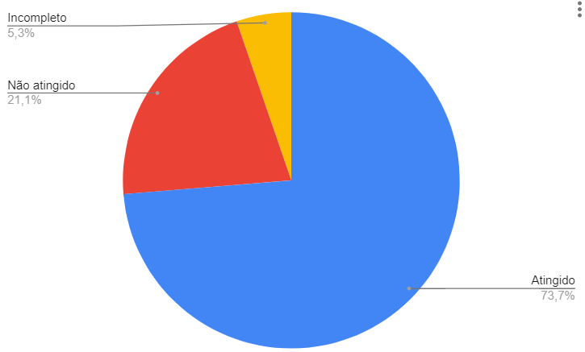
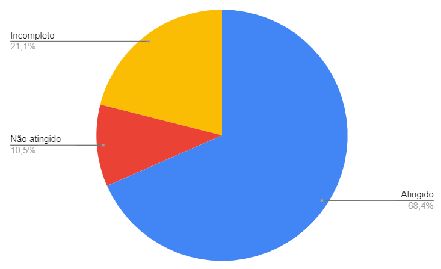
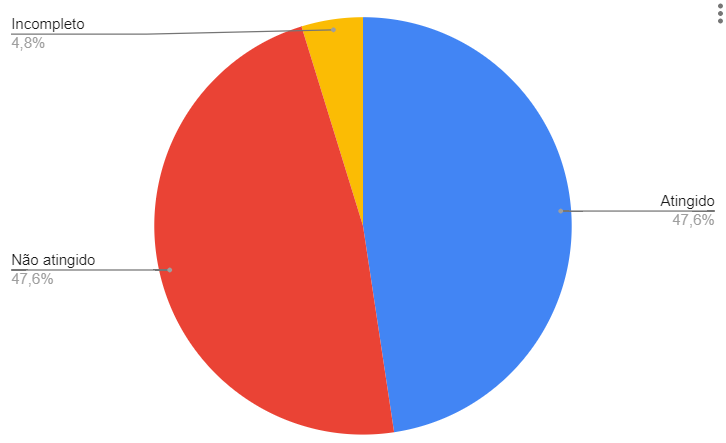
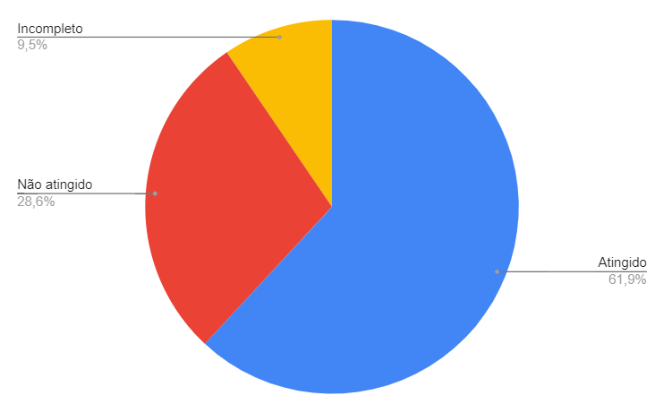

# Relato de Resultados da Verificação - PC4

## Introdução

O presente artefato contém os resultados da verificação dos artefatos produzidos durante o ponto de controle 4 na versão mencionada abaixo:

- [Planejamento da Avaliação do Storyboard](..design_avaliacao_desenvolvimento/nivel_1/storyboard/planejamento_avaliacao.md) versão 1.2
- [Planejamento da Avaliação da Análise de tarefas](../design_avaliacao_desenvolvimento/nivel_1/analise_tarefas/planejamento_avaliacao.md) versão 1.0
- [Planejamento do relato dos resultados da Avaliação do Storyboard](../design_avaliacao_desenvolvimento/nivel_1/storyboard/planejamento_relato.md) versão 1.0
- [Planejamento do relato dos resultados da Avaliação da Análise de tarefas](../design_avaliacao_desenvolvimento/nivel_1/analise_tarefas/planejamento_resultado_analise_tarefas.md) versão 1.0

## Metodologia

A verificação foi feita com base nas listas de verificação definidas no [planejamento](pc4-planejamento.md).

## Resultados

### Verificação - Planejamento da Avaliação do Storyboard

As Tabelas 1 e 2 apresentam os resultados da verificação do artefato [Planejamento da Avaliação do Storyboard](..design_avaliacao_desenvolvimento/nivel_1/storyboard/planejamento_avaliacao.md).

| ID  | Questão                                                                  | Resposta |                   Comentário                    |
| :-: | :----------------------------------------------------------------------- | :------: | :---------------------------------------------: |
|  1  | As legendas estão no padrão do projeto?                                  |   Não    | Não há legenda referente à tabela do cronograma |
|  2  | Possui links para os outros artefatos?                                   |   Sim    |                                                 |
|  3  | Existe uma introdução no artefato?                                       |   Sim    |                                                 |
|  4  | Existe tabela de versionamento padronizado e completo?                   |   Sim    |                                                 |
|  5  | Há referências bibliográficas no artefato?                               |   Sim    |                                                 |
|  6  | As tabelas e imagens possuem legenda, fonte e são introduzidas no texto? |   Sim    |                                                 |

Tabela 1: Verificação de padronização do artefato Planejamento da Avaliação do Storyboard (Fonte: autor, 2023).

| ID  | Questão                                                                                                                                                        |  Resposta  |                 Comentário                 |
| :-: | :------------------------------------------------------------------------------------------------------------------------------------------------------------- | :--------: | :----------------------------------------: |
|  1  | O artefato apresenta e utiliza o framework DECIDE para realização do Planejamento da Avaliação do Storyboard ?                                                 |    Sim     |                                            |
|  2  | O artefato apresenta os objetivos da Avaliação do Storyboard ?                                                                                                 |    Sim     |                                            |
|  3  | O artefato apresenta a metodologia que será utilizada na Avaliação do Storyboard ?                                                                             |    Sim     |                                            |
|  4  | O artefato apresenta as perguntas e/ou tarefas a serem exploradas durante a Avaliação do Storyboard ?                                                          |    Sim     |                                            |
|  5  | O artefato identifica como ocorrerá o recrutamento dos participantes da Avaliação do Storyboard (perfil e local) ?                                             |    Sim     |                                            |
|  6  | O artefato identifica quantos usuários participarão da Avaliação do Storyboard e a justificativa dessa quantidade ?                                            |    Não     |                                            |
|  7  | O artefato possui um cronograma com data e horário para realização do teste piloto da Avaliação do Storyboard ?                                                |    Sim     |                                            |
|  8  | O artefato possui um cronograma com data e horário para realização da Avaliação do Storyboard ?                                                                |    Sim     |                                            |
|  9  | O artefato identifica o orçamento necessário para a Avaliação do Storyboard ?                                                                                  |    Não     |                                            |
| 10  | O artefato identifica os recursos de mão-de-obra necessários para conduzir a Avaliação do Storyboard, assim como a preparação e os equipamentos necessários ? |    Não     |                                            |
| 11  | O artefato apresenta como serão abordadas as questões éticas ?                                                                                                 |    Sim     |                                            |
| 12  | O artefato apresenta o termo de consentimento a ser utilizado na Avaliação do Storyboard ?                                                                     |    Sim     |                                            |
| 13  | O artefato apresenta quais dados devem ser coletados e como devem ser interpretados ?                                                                          | Incompleto | A interpretação dos dados não é mencionada |

Tabela 2: Verificação de conteúdo do artefato Planejamento da Avaliação do Storyboard (Fonte: autor, 2023).

O gráfico a seguir presente na Figura 1 demonstra a quantidade de itens atingidos, não atingidos e incompletos identificados durante a verificação do Planejamento da Avaliação do Storyboard.

 Figura 1: Quantidade de itens atingidos, não atingidos e incompletos do artefato Planejamento da Avaliação do Storyboard (Fonte: autor, 2023).

### Verificação - Planejamento da Avaliação da Análise de tarefas

As Tabelas 3 e 4 apresentam os resultados da verificação do artefato [Planejamento da Avaliação da Análise de tarefas](../design_avaliacao_desenvolvimento/nivel_1/analise_tarefas/planejamento_avaliacao.md).

| ID  | Questão                                                                  |  Resposta  |               Comentário               |
| :-: | :----------------------------------------------------------------------- | :--------: | :------------------------------------: |
|  1  | As legendas estão no padrão do projeto?                                  |    Sim     |                                        |
|  2  | Possui links para os outros artefatos?                                   |    Sim     |                                        |
|  3  | Existe uma introdução no artefato?                                       |    Sim     |                                        |
|  4  | Existe tabela de versionamento padronizado e completo?                   |    Sim     |                                        |
|  5  | Há referências bibliográficas no artefato?                               |    Sim     |                                        |
|  6  | As tabelas e imagens possuem legenda, fonte e são introduzidas no texto? | Incompleto | A tabela 2 não foi mencionada no texto |

Tabela 3: Verificação de padronização do artefato Planejamento da Avaliação da Análise de tarefas (Fonte: autor, 2023).

| ID  | Questão                                                                                                                                                                         |  Resposta  |                 Comentário                 |
| :-: | :------------------------------------------------------------------------------------------------------------------------------------------------------------------------------ | :--------: | :----------------------------------------: |
|  1  | O artefato apresenta e utiliza o framework DECIDE para realização do Planejamento da Avaliação da Análise de tarefas ?                                                          |    Sim     |                                            |
|  2  | O artefato apresenta os objetivos da Avaliação da Análise de tarefas ?                                                                                                          |    Sim     |                                            |
|  3  | O artefato apresenta a metodologia que será utilizada na Avaliação da Análise de tarefas ?                                                                                      |    Sim     |                                            |
|  4  | O artefato apresenta as perguntas e/ou tarefas a serem exploradas durante a Avaliação da Análise de tarefas ?                                                                   |    Sim     |                                            |
|  5  | O artefato identifica como ocorrerá o recrutamento dos participantes da Avaliação da Análise de tarefas (perfil e local) ?                                                      | Incompleto |  Não é específico quanto ao recrutamento   |
|  6  | O artefato identifica quantos usuários participarão da Avaliação da Análise de tarefas e a justificativa dessa quantidade ?                                                     |    Sim     |                                            |
|  7  | O artefato possui um cronograma com data e horário para realização do teste piloto da Avaliação da Análise de tarefas                                                           |    Não     |                                            |
|  8  | O artefato possui um cronograma com data e horário para realização da Avaliação da Análise de tarefas                                                                           | Incompleto |      O cronograma não está preenchido      |
|  9  | O artefato identifica o orçamento necessário para a Avaliação da Análise de tarefas ?                                                                                           |    Sim     |                                            |
| 10  | O artefato identifica os recursos os recursos de mão-de-obra necessários para conduzir a Avaliação da Análise de tarefas, assim como a preparação e os equipamentos necessários |    Não     |                                            |
| 11  | O artefato apresenta como serão abordadas as questões éticas ?                                                                                                                  |    Sim     |                                            |
| 12  | O artefato apresenta o termo de consentimento a ser utilizado na Avaliação da Análise de tarefas ?                                                                              |    Sim     |                                            |
| 13  | O artefato apresenta quais dados devem ser coletados e como devem ser interpretados ?                                                                                           | Incompleto | A interpretação dos dados não é mencionada |

Tabela 4: Verificação de conteúdo do artefato Planejamento da Avaliação da Análise de tarefas (Fonte: autor, 2023).

O gráfico a seguir presente na Figura 2 demonstra a quantidade de itens atingidos, não atingidos e incompletos identificados durante a verificação do Planejamento da Avaliação da Análise de tarefas.

 Figura 2: Quantidade de itens atingidos, não atingidos e incompletos do artefato Planejamento da Avaliação da Análise de tarefas (Fonte: autor, 2023).

### Verificação - Planejamento do relato dos resultados da Avaliação do Storyboard

As Tabelas 5 e 6 apresentam os resultados da verificação do artefato [Planejamento do relato dos resultados da Avaliação do Storyboard](../design_avaliacao_desenvolvimento/nivel_1/storyboard/planejamento_relato.md).

| ID  | Questão                                                                  | Resposta |               Comentário                |
| :-: | :----------------------------------------------------------------------- | :------: | :-------------------------------------: |
|  1  | As legendas estão no padrão do projeto?                                  |   Sim    |     Não há necessidade de legendas      |
|  2  | Possui links para os outros artefatos?                                   |   Sim    |                                         |
|  3  | Existe uma introdução no artefato?                                       |   Sim    |                                         |
|  4  | Existe tabela de versionamento padronizado e completo?                   |   Sim    |                                         |
|  5  | Há referências bibliográficas no artefato?                               |   Sim    |                                         |
|  6  | As tabelas e imagens possuem legenda, fonte e são introduzidas no texto? |   Sim    | Não há necessidade de tabelas e imagens |

Tabela 5: Verificação de padronização do artefato Planejamento do relato dos resultados da Avaliação do Storyboard (Fonte: autor, 2023).

| ID  | Questão                                                                                                                                 |  Resposta  |                      Comentário                       |
| :-: | :-------------------------------------------------------------------------------------------------------------------------------------- | :--------: | :---------------------------------------------------: |
|  1  | O artefato menciona a apresentação do cronograma realizado das Avaliações do Storyboard ?                                               |    Não     |                                                       |
|  2  | O artefato menciona a apresentação do ambiente onde ocorreram as Avaliações do Storyboard ?                                             |    Não     |                                                       |
|  3  | O artefato menciona a apresentação da quantidade de entrevistados e sua justificativa ?                                                 |    Não     |                                                       |
|  4  | O artefato menciona a apresentação dos participantes da Avaliação do Storyboard e como seu perfil está associado ao perfil do usuário ? |    Não     |                                                       |
|  5  | O artefato menciona a apresentação da quantidade de avaliadores e sua justificativa ?                                                   |    Não     |                                                       |
|  6  | O artefato menciona a apresentação do perfil dos avaliadores ?                                                                          |    Não     |                                                       |
|  7  | O artefato menciona a apresentação das questões éticas ?                                                                                |    Não     |                                                       |
|  8  | O artefato menciona a apresentação do termo de consentimento utilizado na Avaliação do Storyboard ?                                     |    Não     |                                                       |
|  9  | O artefato menciona a apresentação dos objetivos da Avaliação do Storyboard ?                                                           |    Sim     |                                                       |
| 10  | O artefato menciona a apresentação da metodologia utilizada na Avaliação do Storyboard ?                                                |    Sim     |                                                       |
| 11  | O artefato menciona a apresentação das perguntas e/ou tarefas exploradas durante a Avaliação do Storyboard ?                            |    Sim     |                                                       |
| 12  | O artefato menciona a apresentação de um sumário dos dados coletados, incluindo tabelas e gráficos ?                                    | Incompleto | Não especifica como esses dados devem ser registrados |
| 13  | O artefato menciona a apresentação de um relato da interpretação e análise dos dados ?                                                  |    Não     |                                                       |
| 14  | O artefato menciona a apresentação de uma listagem dos problemas encontrados ?                                                          |    Sim     |                                                       |
| 15  | O artefato menciona a sugestão de reprojeto para o sistema ?                                                                            |            |                                                       |

Tabela 6: Verificação de conteúdo do artefato Planejamento do relato dos resultados da Avaliação do Storyboard (Fonte: autor, 2023).

O gráfico a seguir presente na Figura 3 demonstra a quantidade de itens atingidos, não atingidos e incompletos identificados durante a verificação do Planejamento do relato dos resultados da Avaliação do Storyboard.

 Figura 3: Quantidade de itens atingidos, não atingidos e incompletos do artefato Planejamento do relato dos resultados da Avaliação do Storyboard (Fonte: autor, 2023).

### Verificação - Planejamento do relato dos resultados da Avaliação da Análise de tarefas

As Tabelas 7 e 8 apresentam os resultados da verificação do artefato [Planejamento do relato dos resultados da Avaliação da Análise de tarefas](../design_avaliacao_desenvolvimento/nivel_1/analise_tarefas/planejamento_resultado_analise_tarefas.md).

| ID  | Questão                                                                  | Resposta | Comentário |
| :-: | :----------------------------------------------------------------------- | :------: | :--------: |
|  1  | As legendas estão no padrão do projeto?                                  |   Sim    |            |
|  2  | Possui links para os outros artefatos?                                   |   Sim    |            |
|  3  | Existe uma introdução no artefato?                                       |   Sim    |            |
|  4  | Existe tabela de versionamento padronizado e completo?                   |   Sim    |            |
|  5  | Há referências bibliográficas no artefato?                               |   Sim    |            |
|  6  | As tabelas e imagens possuem legenda, fonte e são introduzidas no texto? |   Sim    |            |

Tabela 7: Verificação de padronização do artefato Planejamento do relato dos resultados da Avaliação da Análise de tarefas (Fonte: autor, 2023).

| ID  | Questão                                                                                                                                         |  Resposta  |                                    Comentário                                    |
| :-: | :---------------------------------------------------------------------------------------------------------------------------------------------- | :--------: | :------------------------------------------------------------------------------: |
|  1  | O artefato menciona a apresentação do cronograma realizado das Avaliações da Análise de tarefas ?                                               |    Sim     |                                                                                  |
|  2  | O artefato menciona a apresentação do ambiente onde ocorreram as Avaliações da Análise de tarefas ?                                             |    Sim     |                                                                                  |
|  3  | O artefato menciona a apresentação da quantidade de entrevistados e sua justificativa ?                                                         |    Não     |                                                                                  |
|  4  | O artefato menciona a apresentação dos participantes da Avaliação da Análise de tarefas e como seu perfil está associado ao perfil do usuário ? | Incompleto | Deve ser adicionado como  o perfil do participante se relaciona com o do usuário |
|  5  | O artefato menciona a apresentação da quantidade de avaliadores e sua justificativa ?                                                           |    Não     |                                                                                  |
|  6  | O artefato menciona a apresentação do perfil dos avaliadores ?                                                                                  |    Não     |                                                                                  |
|  7  | O artefato menciona a apresentação das questões éticas ?                                                                                        |    Não     |                                                                                  |
|  8  | O artefato menciona a apresentação do termo de consentimento utilizado na Avaliação da Análise de tarefas ?                                     |    Não     |                                                                                  |
|  9  | O artefato menciona a apresentação dos objetivos da Avaliação da Análise de tarefas ?                                                           |    Sim     |                                                                                  |
| 10  | O artefato menciona a apresentação da metodologia utilizada na Avaliação da Análise de tarefas ?                                                |    Sim     |                                                                                  |
| 11  | O artefato menciona a apresentação das perguntas e/ou tarefas exploradas durante a Avaliação da Análise de tarefas ?                            |    Não     |                                                                                  |
| 12  | O artefato menciona a apresentação de um sumário dos dados coletados, incluindo tabelas e gráficos ?                                            | Incompleto |              Não especifica como esses dados devem ser registrados               |
| 13  | O artefato menciona a apresentação de um relato da interpretação e análise dos dados ?                                                          |    Sim     |                                                                                  |
| 14  | O artefato menciona a apresentação de uma listagem dos problemas encontrados ?                                                                  |    Sim     |                                                                                  |
| 15  | O artefato menciona a sugestão de reprojeto para o sistema ?                                                                                    |    Sim     |                                                                                  |

Tabela 8: Verificação de conteúdo do artefato Planejamento do relato dos resultados da Avaliação da Análise de tarefas (Fonte: autor, 2023).

O gráfico a seguir presente na Figura 4 demonstra a quantidade de itens atingidos, não atingidos e incompletos identificados durante a verificação do Planejamento do relato dos resultados da Avaliação da Análise de tarefas.

 Figura 4: Quantidade de itens atingidos, não atingidos e incompletos do artefato Planejamento do relato dos resultados da Avaliação da Análise de tarefas (Fonte: autor, 2023).

### Verificação - [Cronograma Realizado - PC4](planejamento/cronograma_realizado/#cronograma-ponto-de-controle-4.md)

Parte dos autores, revisores e datas presentes no cronograma realizado não estão de acordo com as datas de entrega dos artefatos. É necessário trocar os termos "Data Limite de Entrega" e "Data Limite de Revisão" para "Data de Entrega" e "Data de Revisão", pois se trata de um cronograma realizado.

## Planejamento dos ajustes

Com base nos resultados das verificações, foram elencadas as tarefas que devem ser realizadas. Alguns problemas não contemplados pelas listas de checagem foram identificados e incluídos diretamente nas tarefas. A organização dessas tarefas será feita por meio de _issues_ no [repositório](https://github.com/Interacao-Humano-Computador/2022.2-Lichess/issues/) da disciplina.

### Tarefas

#### [Planejamento da Avaliação do Storyboard](..design_avaliacao_desenvolvimento/nivel_1/storyboard/planejamento_avaliacao.md)

- Adicionar tradução das expressões em inglês e siglas utilizadas (aplicação Web, framework, GUI).
- Mudar o nome lichess para Lichess, com maiúscula no início.
- Adição de legendas no cronograma da avaliação e menção da mesma no texto.
- Adicionar o papel do segundo avaliador na seção Papéis dos Avaliadores
- Atualização do termo de consentimento.
- Adicionar a quantidade de usuários que serão entrevistados e a justificativa para a mesma.
- Identificar o orçamento necessário para a realização da Avaliação do Storyboard.
- Identifica os recursos de mão-de-obra necessários para conduzir a Avaliação do Storyboard, assim como a preparação e os equipamentos necessários.
- Adicionar como os dados coletados devem ser interpretados.

 | Data Limite de Entrega | Data Limite Revisão | Autor(es) |  Revisor(es)  |
 | :--------------------: | :-----------------: | :-------: | :-----------: |
 |       30/01/2023       |     30/01/2023      |  Nicolas  | Lucas Gabriel |

#### [Planejamento da Avaliação da Análise de tarefas](../design_avaliacao_desenvolvimento/nivel_1/analise_tarefas/planejamento_avaliacao.md)

- Adicionar tradução das expressões em inglês utilizadas (framework).
- Adicionar capitulo e edição do livro mencionado na tabela de perguntas.
- Preenchimento dos cronogramas de avaliação.
- Atualização do termo de consentimento.
- Adição do Cronograma do teste piloto.

 | Data Limite de Entrega | Data Limite Revisão |   Autor(es)   | Revisor(es) |
 | :--------------------: | :-----------------: | :-----------: | :---------: |
 |       30/01/2023       |     30/01/2023      | Lucas Gabriel |   Nicolas   |

#### [Planejamento do relato dos resultados da Avaliação do Storyboard](../design_avaliacao_desenvolvimento/nivel_1/storyboard/planejamento_relato.md)

- Adicionar que o relato dos resultados deve possuir o cronograma realizado de entrevistas.
- Adicionar que o relato dos resultados deve possuir o ambiente onde a entrevista ocorreu.
- Adicionar que o relato dos resultados deve possuir a quantidade de entrevistados e a razão dessa.
- Adicionar que o relato dos resultados deve possuir como os participantes estão associados ao perfil do usuário.
- Adicionar que o relato dos resultados deve possuir a quantidade de avaliadores e uma justificativa para isso, a função de cada avaliador.
- Adicionar que o relato dos resultados deve possuir o perfil dos avaliadores.
- Adicionar que o relato dos resultados deve possuir as questões éticas consideradas.
- Adicionar que o relato dos resultados deve possuir o termo de consentimento utilizado.
- Especifica onde o sumário dos dados devem ser registrados, por exemplo em uma tabela.

**Observação**: essa considerações também são válidas para o artefato [Planejamento do Relato de Resultados dos artefatos avaliados](../design_avaliacao_desenvolvimento/nivel_1/planejamento_do_relato_de_resultados.md)

 | Data Limite de Entrega | Data Limite Revisão | Autor(es) |  Revisor(es)  |
 | :--------------------: | :-----------------: | :-------: | :-----------: |
 |       30/01/2023       |     30/01/2023      |  Nicolas  | Lucas Gabriel |

#### [Planejamento do relato dos resultados da Avaliação da Análise de tarefas](../design_avaliacao_desenvolvimento/nivel_1/analise_tarefas/planejamento_resultado_analise_tarefas.md)

- Adicionar que o relato dos resultados deve possuir a quantidade de entrevistados e a razão dessa.
- Adicionar que o relato dos resultados deve possuir como os participantes estão associados ao perfil do usuário.
- Adicionar que o relato dos resultados deve possuir a quantidade de avaliadores e uma justificativa para isso, a função de cada avaliador.
- Adicionar que o relato dos resultados deve possuir o perfil dos avaliadores.
- Adicionar que o relato dos resultados deve possuir as questões éticas consideradas.
- Adicionar que o relato dos resultados deve possuir o termo de consentimento utilizado.
- Especifica onde o sumário dos dados devem ser registrados, por exemplo em uma tabela.
- Adicionar que o relato dos resultados deve possuir as perguntas e/ou tarefas exploradas durante a avaliação.

 | Data Limite de Entrega | Data Limite Revisão | Autor(es) | Revisor(es) |
 | :--------------------: | :-----------------: | :-------: | :---------: |
 |       30/01/2023       |     30/01/2023      | Mauricio  |   Nicolas   |

#### Cronograma Realizado [Cronograma Realizado - PC4](planejamento/cronograma_realizado.md)
- Corrigir autores no PC4, incluir Lucas Macedo no Planejamento da avaliação storyboard e retirá-lo da gravação da reunião, pois não estava presente.
- Remover a expressão data limite.

 | Data Limite de Entrega | Data Limite Revisão |   Autor(es)   | Revisor(es) |
 | :--------------------: | :-----------------: | :-----------: | :---------: |
 |       30/01/2023       |     30/01/2023      | Lucas Gabriel |   Nicolas   |

## Bibliografia

[1] Plano de Ensino da disciplina Interação Humano Computador.

[2] Gerência e Qualidade de Software - Aula 06 - Técnica de revisão – UNIVESP. 

[3] Gerência e Qualidade de Software - Aula 05 - Verificação e Validação – UNIVESP. 

[4] BARBOSA, Simone; DINIZ, Bruno. Interação Humano-Computador. Editora Elsevier, Rio de Janeiro, 2010. 

[5] GOOGLE Planilhas. [S. l.]. Disponível em: https://www.google.com/intl/pt-BR/sheets/about/. Acesso em: 26 jan. 2023.

## Histórico de Versão

| Versão | Data       | Descrição            | Autor(es)     | Revisor(es) |
| ------ | ---------- | -------------------- | ------------- | ----------- |
| `1.0`  | 26/01/2023 | Criação do documento | Lucas Gabriel | Nicolas     |
