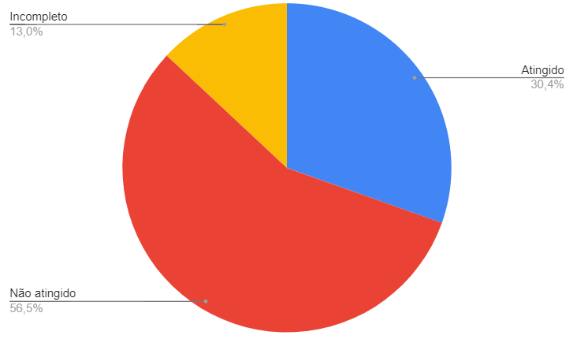

# Relato de Resultados da Verificação - PC7

## Introdução

O presente artefato contém os resultados da verificação dos artefatos produzidos durante o ponto de controle 7 na versão mencionada abaixo:

- [Relato dos resultados do Protótipo de Papel](../design_avaliacao_desenvolvimento/nivel_2/relato_resultados_prototipo_papel.md) versão 1.2
- [Planejamento da Avaliação do Protótipo de Alta Fidelidade](../design_avaliacao_desenvolvimento/nivel_3/planejamento_alta_fidelidade.md) versão 1.0
- [Planejamento do relato dos resultados da Avaliação do Protótipo de Alta Fidelidade](/design_avaliacao_desenvolvimento/nivel_3/planejamento_relato_resultados_alta_fidelidade.md) versão 1.0

## Metodologia

A verificação foi feita com base nas listas de verificação definidas no [planejamento](pc7-planejamento.md).

## Resultados

### Verificação - Relato dos resultados do Protótipo de Papel

As Tabelas 1 e 2 apresentam os resultados da verificação do artefato [Relato dos resultados do Protótipo de Papel](../design_avaliacao_desenvolvimento/nivel_2/relato_resultados_prototipo_papel.md).

| ID  | Questão                                                                  | Resposta |                          Comentário                          |
| :-: | :----------------------------------------------------------------------- | :------: | :----------------------------------------------------------: |
|  1  | As legendas estão no padrão do projeto?                                  |   Não    | As legendas das imagens e vídeos não condizem com as imagens |
|  2  | Possui links para os outros artefatos?                                   |   Não    |                                                              |
|  3  | Existe uma introdução no artefato?                                       |   Sim    |                                                              |
|  4  | Existe tabela de versionamento padronizado e completo?                   |   Sim    |                                                              |
|  5  | Há referências bibliográficas no artefato?                               |   Sim    |                                                              |
|  6  | As tabelas e imagens possuem legenda, fonte e são introduzidas no texto? |   Não    |                                                              |

Tabela 1: Verificação de padronização do artefato Relato dos resultados do Protótipo de Papel (Fonte: autor, 2023).

| ID  | Questão                                                                                                                       |  Resposta  |                          Comentário                           |
| :-: | :---------------------------------------------------------------------------------------------------------------------------- | :--------: | :-----------------------------------------------------------: |
|  1  | O artefato apresenta a metodologia utilizada na Avaliação do Protótipo de Papel ?                                             |    Sim     |                                                               |
|  2  | O artefato apresenta os objetivos da Avaliação do Protótipo de Papel ?                                                        |    Sim     |                                                               |
|  3  | O artefato apresenta a quantidade de entrevistados e sua justificativa ?                                                      | Incompleto | A quantidade não é justificada adequadamente e está incorreta |
|  4  | O artefato apresenta como o perfil dos participantes da Avaliação do Protótipo de Papel está associado ao perfil do usuário ? |    Não     |                                                               |
|  5  | O artefato apresenta a quantidade de avaliadores e sua justificativa ?                                                        | Incompleto |  A quantidade é especificada apenas para uma das entrevistas  |
|  6  | O artefato apresenta o perfil dos avaliadores ?                                                                               |    Não     |                                                               |
|  7  | O artefato apresenta como as questões éticas foram abordadas na Avaliação do Protótipo de Papel ?                             |    Não     |                                                               |
|  8  | O artefato apresenta o termo de consentimento utilizado na Avaliação do Protótipo de Papel  ?                                 |    Não     |                                                               |
|  9  | O artefato apresenta as perguntas e/ou tarefas exploradas durante a Avaliação do Protótipo de Papel  ?                        |    Não     |                                                               |
| 10  | O artefato apresenta um sumário dos dados coletados, incluindo tabelas e gráficos ?                                           |    Não     |                                                               |
| 11  | O artefato apresenta uma listagem dos problemas encontrados ?                                                                 | Incompleto |         É apresentada apenas para uma das avaliações          |
| 12  | O artefato apresenta as conclusões da avaliação dos resultados da Avaliação do Protótipo de Papel ?                           |    Sim     |                                                               |
| 13  | O artefato apresenta sugestões de reprojeto para o sistema ?                                                                  |    Não     |                                                               |
| 14  | O artefato apresenta o cronograma realizado do teste piloto da Avaliação do Protótipo de Papel com data, hora e local ?       |    Não     |                                                               |
| 15  | O artefato apresenta os cronogramas das Avaliações do Protótipo de Papel  realizadas com data, hora e local ?                 |    Não     |                                                               |
| 16  | O artefato apresenta a gravação do teste piloto da Avaliação do Protótipo de Papel ?                                          |    Não     |                                                               |
| 17  | O artefato apresenta a gravação das Avaliações do Protótipo de Papel ?                                                        |    Sim     |                                                               |

Tabela 2: Verificação de conteúdo do artefato Relato dos resultados do Protótipo de Papel (Fonte: autor, 2023).

O gráfico a seguir presente na Figura 1 demonstra a quantidade de itens atingidos, não atingidos e incompletos identificados durante a verificação do Relato dos resultados do Protótipo de Papel.

 Figura 1: Quantidade de itens atingidos, não atingidos e incompletos do artefato Relato dos resultados do Protótipo de Papel (Fonte: autor, 2023).

### Verificação - Planejamento da Avaliação do Protótipo de Alta Fidelidade

As Tabelas 3 e 4 apresentam os resultados da verificação do artefato [Planejamento da Avaliação do Protótipo de Alta Fidelidade](../design_avaliacao_desenvolvimento/nivel_3/planejamento_alta_fidelidade.md).

| ID  | Questão                                                                  | Resposta | Comentário |
| :-: | :----------------------------------------------------------------------- | :------: | :--------: |
|  1  | As legendas estão no padrão do projeto?                                  |   Sim    |            |
|  2  | Possui links para os outros artefatos?                                   |   Sim    |            |
|  3  | Existe uma introdução no artefato?                                       |   Sim    |            |
|  4  | Existe tabela de versionamento padronizado e completo?                   |   Sim    |            |
|  5  | Há referências bibliográficas no artefato?                               |   Sim    |            |
|  6  | As tabelas e imagens possuem legenda, fonte e são introduzidas no texto? |   Sim    |            |

Tabela 3: Verificação de padronização do artefato Planejamento da Avaliação do Protótipo de Alta Fidelidade (Fonte: autor, 2023).

#### Lista de verificação - Planejamento da Avaliação do Protótipo de Alta Fidelidade

| ID  | Questão                                                                                                                                                                         | Resposta | Comentário |
| :-: | :------------------------------------------------------------------------------------------------------------------------------------------------------------------------------ | :------: | :--------: |
|  1  | O artefato apresenta e utiliza o framework DECIDE para realização do Planejamento da Avaliação do Protótipo de Alta Fidelidade ?                                                |   Sim    |            |
|  2  | O artefato apresenta os objetivos da Avaliação do Protótipo de Alta Fidelidade ?                                                                                                |   Sim    |            |
|  3  | O artefato apresenta a metodologia que será utilizada na Avaliação do Protótipo de Alta Fidelidade ?                                                                            |   Sim    |            |
|  4  | O artefato apresenta as perguntas e/ou tarefas a serem exploradas durante a Avaliação do Protótipo de Alta Fidelidade ?                                                         |   Sim    |            |
|  5  | O artefato identifica como ocorrerá o recrutamento dos participantes da Avaliação do Protótipo de Alta Fidelidade (perfil e local) ?                                            |   Sim    |            |
|  6  | O artefato identifica quantos usuários participarão da Avaliação do Protótipo de Alta Fidelidade e a justificativa dessa quantidade ?                                           |   Sim    |            |
|  7  | O artefato possui um cronograma com data e horário para realização do teste piloto da Avaliação do Protótipo de Alta Fidelidade ?                                               |   Sim    |            |
|  8  | O artefato possui um cronograma com data e horário para realização da Avaliação do Protótipo de Alta Fidelidade ?                                                               |   Sim    |            |
|  9  | O artefato identifica o orçamento necessário para a Avaliação do Protótipo de Alta Fidelidade ?                                                                                 |   Não    |            |
| 10  | O artefato identifica os recursos de mão-de-obra necessários para conduzir a Avaliação do protótipo de alta fidelidade, assim como a preparação e os equipamentos necessários ? |   Sim    |            |
| 11  | O artefato apresenta como serão abordadas as questões éticas ?                                                                                                                  |   Sim    |            |
| 12  | O artefato apresenta o termo de consentimento a ser utilizado na Avaliação do Protótipo de Alta Fidelidade ?                                                                    |   Sim    |            |
| 13  | O artefato apresenta quais dados devem ser coletados e como devem ser interpretados ?                                                                                           |   Sim    |            |

Tabela 4: Verificação de conteúdo do artefato Planejamento da Avaliação do Protótipo de Alta Fidelidade (Fonte: autor, 2023).

O gráfico a seguir presente na Figura 2 demonstra a quantidade de itens atingidos, não atingidos e incompletos identificados durante a verificação do Planejamento da Avaliação do Protótipo de Alta Fidelidade.

 Figura 2: Quantidade de itens atingidos, não atingidos e incompletos do artefato Planejamento da Avaliação do Protótipo de Alta Fidelidade (Fonte: autor, 2023).

### Verificação - Planejamento do relato dos resultados da Avaliação do Protótipo de Alta Fidelidade

As Tabelas 5 e 6 apresentam os resultados da verificação do artefato [Planejamento do relato dos resultados da Avaliação do Protótipo de Alta Fidelidade](/design_avaliacao_desenvolvimento/nivel_3/planejamento_relato_resultados_alta_fidelidade.md).

| ID  | Questão                                                                  | Resposta | Comentário |
| :-: | :----------------------------------------------------------------------- | :------: | :--------: |
|  1  | As legendas estão no padrão do projeto?                                  |   Sim    |            |
|  2  | Possui links para os outros artefatos?                                   |   Sim    |            |
|  3  | Existe uma introdução no artefato?                                       |   Sim    |            |
|  4  | Existe tabela de versionamento padronizado e completo?                   |   Sim    |            |
|  5  | Há referências bibliográficas no artefato?                               |   Sim    |            |
|  6  | As tabelas e imagens possuem legenda, fonte e são introduzidas no texto? |   Sim    |            |

Tabela 5: Verificação de padronização do artefato Planejamento do relato dos resultados da Avaliação do Protótipo de Alta Fidelidade (Fonte: autor, 2023).

| ID  | Questão                                                                                                                                                   | Resposta | Comentário |
| :-: | :-------------------------------------------------------------------------------------------------------------------------------------------------------- | :------: | :--------: |
|  1  | O artefato menciona a apresentação do cronograma realizado das Avaliações do Protótipo de Alta Fidelidade ?                                               |   Sim    |            |
|  2  | O artefato menciona a apresentação do ambiente onde ocorreram as Avaliações do Protótipo de Alta Fidelidade ?                                             |   Sim    |            |
|  3  | O artefato menciona a apresentação da quantidade de entrevistados e sua justificativa ?                                                                   |   Sim    |            |
|  4  | O artefato menciona a apresentação dos participantes da Avaliação do Protótipo de Alta Fidelidade e como seu perfil está associado ao perfil do usuário ? |   Sim    |            |
|  5  | O artefato menciona a apresentação da quantidade de avaliadores e sua justificativa ?                                                                     |   Sim    |            |
|  6  | O artefato menciona a apresentação do perfil dos avaliadores ?                                                                                            |   Sim    |            |
|  7  | O artefato menciona a apresentação das questões éticas ?                                                                                                  |   Sim    |            |
|  8  | O artefato menciona a apresentação do termo de consentimento utilizado na Avaliação do Protótipo de Alta Fidelidade ?                                     |   Sim    |            |
|  9  | O artefato menciona a apresentação dos objetivos da Avaliação do Protótipo de Alta Fidelidade ?                                                           |   Sim    |            |
| 10  | O artefato menciona a apresentação da metodologia utilizada na Avaliação do Protótipo de Alta Fidelidade ?                                                |   Sim    |            |
| 11  | O artefato menciona a apresentação das perguntas e/ou tarefas exploradas durante a Avaliação do Protótipo de Alta Fidelidade ?                            |   Sim    |            |
| 12  | O artefato menciona a apresentação de um sumário dos dados coletados, incluindo tabelas e gráficos ?                                                      |   Sim    |            |
| 13  | O artefato menciona a apresentação de um relato da interpretação e análise dos dados ?                                                                    |   Sim    |            |
| 14  | O artefato menciona a apresentação de uma listagem dos problemas encontrados ?                                                                            |   Sim    |            |
| 15  | O artefato menciona a sugestão de reprojeto para o sistema ?                                                                                              |   Sim    |            |

Tabela 6: Verificação de conteúdo do artefato Planejamento do relato dos resultados da Avaliação do Protótipo de Alta Fidelidade (Fonte: autor, 2023).

O gráfico a seguir presente na Figura 3 demonstra a quantidade de itens atingidos, não atingidos e incompletos identificados durante a verificação do Planejamento do relato dos resultados da Avaliação do Protótipo de Alta Fidelidade.

 Figura 3: Quantidade de itens atingidos, não atingidos e incompletos do artefato Planejamento do relato dos resultados da Avaliação do Protótipo de Alta Fidelidade (Fonte: autor, 2023).

### Verificação - [Cronograma Realizado - PC7](../planejamento/cronograma_realizado.md#cronograma-ponto-de-controle-7)

É necessário trocar os termos "Data Limite de Entrega" e "Data Limite de Revisão" para "Data de Entrega" e "Data de Revisão", pois se trata de um cronograma realizado.

## Planejamento dos ajustes

Com base nos resultados das verificações, foram elencadas as tarefas que devem ser realizadas. Alguns problemas não contemplados pelas listas de verificação foram identificados e incluídos diretamente nas tarefas. A organização dessas tarefas será feita por meio de _issues_ no [repositório](https://github.com/Interacao-Humano-Computador/2022.2-Lichess/issues/) da disciplina.

### Tarefas

#### [Relato dos resultados do Protótipo de Papel](../design_avaliacao_desenvolvimento/nivel_2/relato_resultados_prototipo_papel.md)

- Correção das legendas do artefato
- Adição de links para outros artefatos relativos a esse
- Adição texto para introduzir as tabelas e imagens
- Adição de uma justificativa baseada na bibliografia para a quantidade de entrevistados
- Adição de como o perfil dos participantes da Avaliação do Protótipo de Papel está está associado ao perfil do usuário
- Adição da quantidade de avaliadores e perfil dos avaliadores
- Adição de como foram abordadas as questões éticas e o termo de consentimento utilizado
- Adição das perguntas exploradas durante a avaliação
- Adição de um sumário dos dados coletados, incluindo tabelas e gráficos
- Adição de uma listagem dos problemas encontrados
- Adição de sugestões de reprojeto para o sistema
- Adição do cronograma realizado do teste piloto das Avaliações do Protótipo de Papel com data, hora e local
- Adição dos cronogramas das Avaliações do Protótipo de Papel  realizadas com data, hora e local
- Adição da gravação do teste piloto da Avaliação do Protótipo de Papel

 | Data Limite de Entrega | Data Limite Revisão |               Autor(es)               | Revisor(es) |
 | :--------------------: | :-----------------: | :-----------------------------------: | :---------: |
 |       30/01/2023       |     30/01/2023      | Lucas Gabriel, Lucas Macedo, Mauricio | Davi        |

#### [Planejamento da Avaliação do Protótipo de Alta Fidelidade](../design_avaliacao_desenvolvimento/nivel_3/planejamento_alta_fidelidade.md)

- Adicionar tradução das expressões em inglês e siglas utilizadas (aplicação Web, framework).
- Mudar o nome lichess para Lichess, com maiúscula no início.
- Identificar o orçamento necessário para a realização do Planejamento da Avaliação do Protótipo de Alta Fidelidade.

 | Data Limite de Entrega | Data Limite Revisão | Autor(es) | Revisor(es) |
 | :--------------------: | :-----------------: | :-------: | :---------: |
 |       30/01/2023       |     30/01/2023      |  Nicolas Souza|    Davi     |

#### [Planejamento do relato dos resultados da Avaliação do Protótipo de Alta Fidelidade](/design_avaliacao_desenvolvimento/nivel_3/planejamento_relato_resultados_alta_fidelidade.md)

- **Não há tarefas relacionadas a esse artefato**

#### Cronograma Realizado [Cronograma Realizado - PC4](../planejamento/cronograma_realizado.md#cronograma-ponto-de-controle-4)

- Remover a expressão data limite.

 | Data Limite de Entrega | Data Limite Revisão |   Autor(es)   | Revisor(es) |
 | :--------------------: | :-----------------: | :-----------: | :---------: |
 |       30/01/2023       |     30/01/2023      | Lucas Gabriel |   Nicolas Souza |

## Bibliografia

[1] Plano de Ensino da disciplina Interação Humano Computador.

[2] Gerência e Qualidade de Software - Aula 06 - Técnica de revisão – UNIVESP. 

[3] Gerência e Qualidade de Software - Aula 05 - Verificação e Validação – UNIVESP. 

[4] BARBOSA, Simone; DINIZ, Bruno. Interação Humano-Computador. Editora Elsevier, Rio de Janeiro, 2010. 

[5] GOOGLE Planilhas. [S. l.]. Disponível em: <https://www.google.com/intl/pt-BR/sheets/about/>. Acesso em: 26 jan. 2023.

## Histórico de Versão

| Versão | Data       | Descrição                                                      | Autor(es)     | Revisor(es) |
| ------ | ---------- | -------------------------------------------------------------- | ------------- | ----------- |
| `1.0`  | 18/01/2023 | Criação do documento                                           | Lucas Gabriel | Nicolas Souza   |
| `2.0`  | 26/01/2023 | Ajuste do documento para o padrão dos artefatos de verificação | Lucas Gabriel | Nicolas Souza   |
