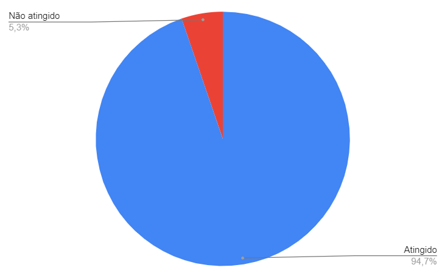

# Verificação - Entrevista

## Introdução

Segundo o CMMI, a verificação busca garantir que os produtos de trabalho selecionados cumpram os seus requisitos especificados [1]. Por tanto, nessa etapa será realizada a verificação do artefato Planejamento da Avaliação do protótipo de alta fidelidade , feito pelo Grupo 2 (Lichess), com intuito de analisar se esse modelo está de acordo com o que se espera dele [2].

## Metodologia

A metodologia utilizada foi a inspeção validando-se de uma lista de requisitos para checagem (check list) com o intuito de descobrir defeitos no documento e assim verificar se o modelo está de acordo com a notação do modelo e com o que se espera desse modelo [2].

## Rastreabilidade

O artefato Planejamento da Avaliação do protótipo de alta fidelidade pode ser consultado nesse [link](https://interacao-humano-computador.github.io/2022.2-Lichess/design_avaliacao_desenvolvimento/nivel_3/planejamento_alta_fidelidade/).

## Checklist

O checklist utilizado e a inspeção realizada podem ser observados na Tabela 1.

| Identificador | Questão                                                                                                                          | Resposta (Sim / Não / Incompleto) | Observações                                      |
| ------------- | -------------------------------------------------------------------------------------------------------------------------------- | --------------------------------- | ------------------------------------------------ |
| 01            | O artefato possui uma introdução ?                                                                                               | Sim                               |                                                  |
| 02            | As tabelas do artefato possuem legenda e fonte e são chamadas no texto ?                                                         | Sim                               |                                                  |
| 03            | O artefato apresenta referências bibliográficas ?                                                                                | Sim                               |                                                  |
| 04            | O artefato possui histórico de versão padronizado com autor(es) e revisor(es) ?                                                  | Sim                               |                                                  |
| 05            | O artefato apresenta e utiliza o framework DECIDE para realização do planejamento da avaliação do protótipo de alta fidelidade ? | Sim                               |                                                  |
| 06            | O artefato apresenta os objetivos da avaliação do protótipo de alta fidelidade ?                                                 | Sim                               |                                                  |
| 07            | O artefato apresenta as perguntas e tarefas a serem exploradas durante a avaliação do protótipo de alta fidelidade ?             | Incompleto                        | Não são especificadas perguntas para a avaliação |
| 08            | O artefato apresenta a metodologia que será utilizada na avaliação do protótipo de alta fidelidade ?                             | Sim                               |                                                  |
| 09            | O artefato identifica as questões práticas da avaliação do protótipo de alta fidelidade e suas soluções ?                        | Sim                               |                                                  |
| 10            | O artefato apresenta como serão abordadas as questões éticas ?                                                                   | Sim                               |                                                  |
| 11            | O artefato apresenta quais dados devem ser coletados e como devem ser interpretados ?                                            | Sim                               |                                                  |
| 12            | O artefato apresenta o cronograma do teste piloto da avaliação do protótipo de alta fidelidade ?                                 | Sim                               |                                                  |
| 13            | O artefato apresenta o cronograma das avaliações do protótipo de alta fidelidade                                                 | Sim                               |                                                  |

 Tabela 1: Checklist do artefato Planejamento da Avaliação do protótipo de alta fidelidade  (Fonte: autor, 2023).

## Gráfico

A figura 1 a seguir demonstra o gráfico no qual indica a porcentagem de itens verificados como corretos pela lista de checagem.

Figura 1 - Gráfico de itens atingidos

## Bibliografia

[1] GERÊNCIA e Qualidade de Software - Aula 05 - Verificação e Validação. [S. l.: s. n.], 2018. Disponível em: <https://www.youtube.com/watch?v=1Y-1zz6rZxo&ab_channel=UNIVESP>. Acesso em: 9 jan. 2023.

[2] SERRANO, Milene; SERRANO, Maurício. Requisitos – Aula 23. [S. l.]. Disponível em: <https://aprender3.unb.br/pluginfile.php/2307566/mod_resource/content/2/Requisitos%20-%20Aula%20023.pdf>. Acesso em: 9 jan. 2023.

[3] GOOGLE Planilhas. [S. l.], 18 jan. 2023. Disponível em: https://www.google.com/intl/pt-BR/sheets/about/. Acesso em: 18 jan. 2023.

## Histórico de Versão

| Versão | Data       | Descrição            | Autor(es)     | Revisor(es) |
| ------ | ---------- | -------------------- | ------------- | ----------- |
| `1.0`  | 18/01/2023 | Criação do documento | Lucas Gabriel |  Nicolas Souza           |